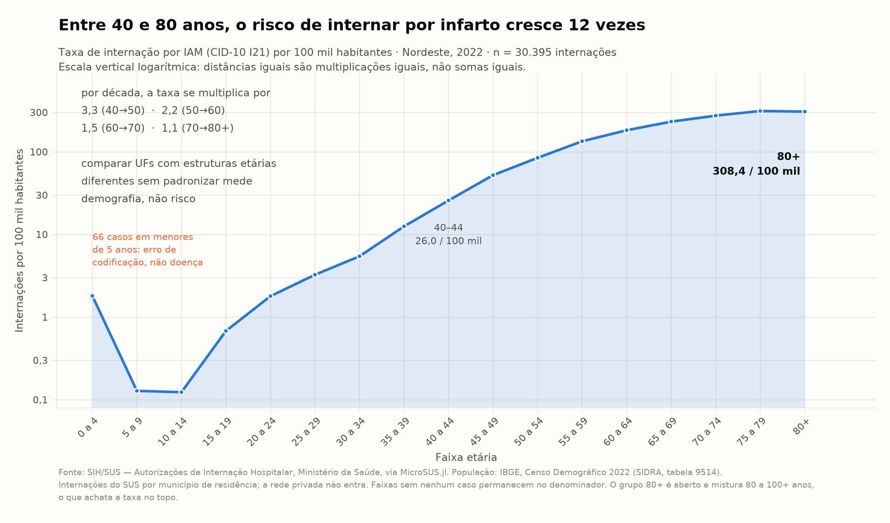
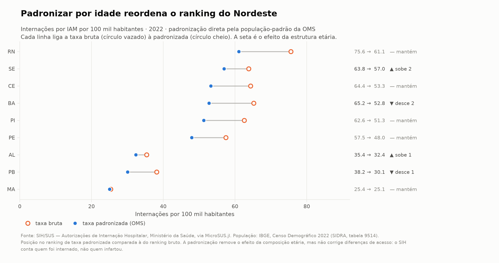
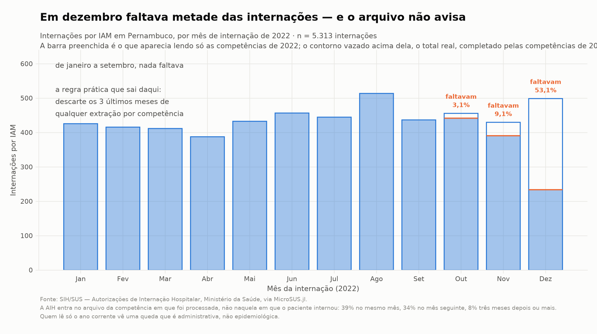
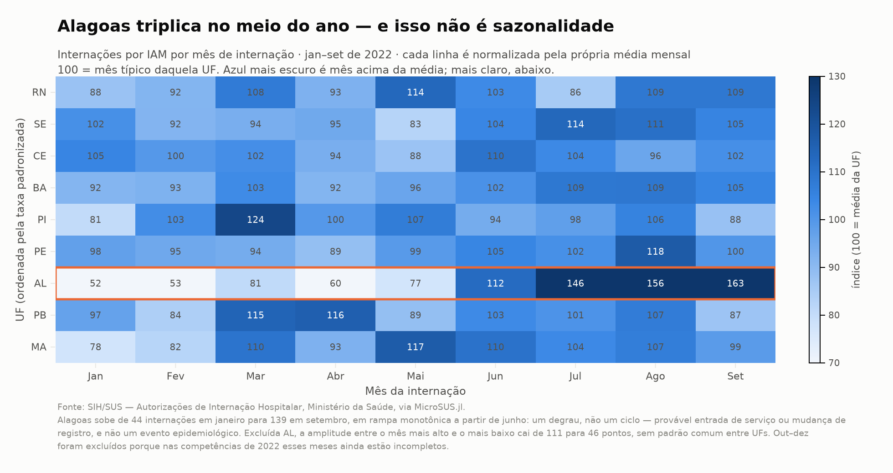

# Exemplos intermediários: análises de ponta a ponta

Esta página pressupõe que você já rodou os
[Exemplos práticos (iniciantes)](exemplos.md) e conhece `DataFrames.jl` —
`groupby`, `combine`, `leftjoin`. O que muda aqui não é a dificuldade do
código: é o objeto. Lá a pergunta era "como chamo a função"; aqui é **"como
faço a análise certa"**.

As armadilhas são o conteúdo. Um campo que existe mas está vazio, um
denominador que perde as faixas etárias sem casos, uma série que cai 53% em
dezembro por motivo administrativo — nada disso gera erro. O código roda, o
gráfico sai bonito e o número está errado.

O fio condutor é um só: **internações por infarto agudo do miocárdio (IAM,
CID-10 I21) no Nordeste em 2022**, do SIH/SUS.

!!! note "Os trechos desta página formam um pipeline"
    As seções compartilham estado e rodam em ordem: `iam` nasce na seção 2,
    `pop` na seção 5. O pipeline inteiro, executável de uma vez, está em
    [`docs/exemplo_intermediario.jl`](https://github.com/dantebertuzzi/MicroSUS.jl/blob/main/docs/exemplo_intermediario.jl)
    no repositório — todos os números desta página saíram de uma execução
    dele. Custo: ~250 MB e cerca de dois minutos na primeira vez; depois o
    cache do Scratch.jl resolve.

## Reprodutibilidade, antes de tudo

O DATASUS **republica bases retroativamente**. A mesma consulta feita hoje e
daqui a seis meses pode devolver números diferentes, sem aviso. Antes de
qualquer análise que vá virar publicação:

```julia
using Pkg, Dates
Pkg.status()                       # versões exatas em uso
println("extração: ", today())     # registre e guarde no material suplementar
```

Fixe o ambiente com `Project.toml` **e** `Manifest.toml` — o segundo prende a
árvore inteira de dependências e é o que torna o ambiente reconstituível com
`Pkg.instantiate()`. Guarde a data de extração junto do resultado. Se o
`baixar` emitir `@warn` sobre dados preliminares (`PRELIM/`), isso vai para a
nota de rodapé da tabela.

---

## 1. Vários anos e UFs: o layout muda debaixo dos pés

**Pergunta:** quero uma série de internações por IAM de 2010 a 2022. Posso
empilhar os arquivos e seguir?

Não sem olhar antes. O layout do SIH mudou três vezes no período:

```julia
using MicroSUS

for ano in (2010, 2011, 2013, 2014, 2022)
    c = baixar(:sih, "PE"; anos = [ano], meses = [6], quieto = true)[1]
    campos = Set(Symbol(x.nome) for x in cabecalho(c).campos)
    println(ano, ": ", length(campos), " campos   DIAGSEC1? ", :DIAGSEC1 in campos)
end
```

```
2010: 86 campos   DIAGSEC1? false
2011: 93 campos   DIAGSEC1? false
2013: 95 campos   DIAGSEC1? false
2014: 113 campos  DIAGSEC1? true
2022: 113 campos  DIAGSEC1? true
```

`cabecalho` lê **só o cabeçalho** — não descomprime os registros.
Verificar o layout de treze anos custa menos de um segundo, e é o primeiro
comando que você deveria rodar em qualquer estudo multi-ano.

Os nove campos `DIAGSEC1`–`DIAGSEC9` **passaram a existir em 2014**. Uma série
2010–2022 que conte "IAM em qualquer posição diagnóstica" vai dar um salto em
2014 que não é epidemiológico: é o formulário que mudou.

O `fetch_datasus` concatena com `cols = :union`, então colunas ausentes viram
`missing` em vez de erro — cômodo, e perigoso: o salto passa despercebido.

**O que pode dar errado aqui**

- Empilhar anos com layouts diferentes sem inspecionar: a variável que você
  quer pode simplesmente não existir na primeira metade da série.
- Confundir "campo ausente" com "valor ausente". `missing` porque a coluna não
  existia em 2010 e `missing` porque o hospital não preencheu são coisas
  diferentes e exigem tratamentos diferentes.
- A alternativa honesta, quando o campo não existe no período inteiro:
  **restringir a série ao período com layout comparável** (aqui, 2014 em
  diante) ou usar só o diagnóstico principal, que existe em todos os anos.

---

## 2. Diagnóstico e procedimento: onde o recorte engana

**Pergunta:** filtrar por `DIAG_PRINC == I21` subestima os casos de infarto?

A resposta usual é "sim, porque ignora os diagnósticos secundários". Vamos
medir em vez de supor.

O filtro roda **dentro do leitor**: campos não pedidos nunca viram `String`, e
linhas rejeitadas não materializam coluna nenhuma. É o que torna viável varrer
a região inteira.

```julia
using MicroSUS, DataFrames

const NE = ["AL","BA","CE","MA","PB","PE","PI","RN","SE"]
const CAMPOS_DIAG = [:DIAG_PRINC, :DIAG_SECUN,
                     (Symbol("DIAGSEC$i") for i in 1:9)...]

# O `filtro` consulta os campos pelo nome, então precisa saber quais existem
# neste arquivo — `cabecalho` responde sem descomprimir nada. (Para a lista de
# `colunas`, `ignorar_ausentes = true` resolve sozinho; o filtro é que não tem
# como adivinhar.)
"Campos diagnósticos que existem de fato no layout deste arquivo."
diag_presentes(caminho) = filter(∈(keys(cabecalho(caminho).indice)), CAMPOS_DIAG)

function carregar_iam(ufs, ano, meses, colunas)
    partes = DataFrame[]; lidas = 0
    for uf in ufs
        for c in baixar(:sih, uf; anos = [ano], meses = meses, quieto = true)
            lidas += cabecalho(c).n_registros
            campos = diag_presentes(c)
            df = DataFrame(ler(c; colunas = colunas, ignorar_ausentes = true,
                    filtro = r -> any(startswith(r[k], "I21") for k in campos)))
            df.UF = fill(uf, nrow(df))
            push!(partes, df)
        end
    end
    vcat(partes...; cols = :union), lidas
end

# As 22 colunas de que o resto da página precisa: os diagnósticos, mais o que
# as seções 4 a 6 consomem (idade, município de residência, competência).
const COLS = [CAMPOS_DIAG..., :PROC_REA, :MUNIC_RES, :IDADE, :COD_IDADE, :SEXO,
              :MORTE, :DT_INTER, :ANO_CMPT, :MES_CMPT, :DIAS_PERM, :VAL_TOT]

t0 = time()
iam, lidas = carregar_iam(NE, 2022, 1:12, COLS)

# O subconjunto com I21 no diagnóstico principal. É o numerador de tudo que
# vem depois — as seções 2 a 6 partem daqui, não de `iam`.
iam_p = iam[startswith.(coalesce.(String.(iam.DIAG_PRINC), ""), "I21"), :]

println("internações lidas: ", lidas)
println("IAM (I21 em qualquer posição): ", nrow(iam))
println("IAM no diagnóstico principal: ", nrow(iam_p))
println("tempo: ", round(time() - t0; digits = 1), " s")
```

```
internações lidas: 3321519
IAM (I21 em qualquer posição): 30809
IAM no diagnóstico principal: 30395
tempo: 48.8 s
```

Custo: **108 arquivos, ~250 MB baixados, 49 segundos**, 3,3 milhões de
registros varridos para materializar 30 mil. Um mês de PE lido inteiro
(113 colunas) ocupa **96 MB de RAM**; as 22 colunas de que precisamos ocupam
**3,2 MB**. Pedir colunas é a diferença entre caber e não caber no notebook.

### O que os campos secundários realmente contêm

```julia
df = DataFrame(ler(baixar(:sih, "PE"; anos=[2022], meses=[6], quieto=true)[1];
                   colunas = [:DIAG_SECUN, :DIAGSEC1]))
unique(String.(df.DIAG_SECUN))          # ["0000"]
count(isempty, String.(df.DIAGSEC1))    # 36183 de 48562
```

Dois achados que mudam o recorte:

1. **`DIAG_SECUN` é `"0000"` em 100% dos 3,3 milhões de registros de 2022.**
   Quem filtrar por ele encontra zero e pode concluir que não há diagnóstico
   secundário nenhum.
2. **`DIAGSEC1` está preenchido em 15,6% das internações.** Em 2022 os
   secundários reais vivem em `DIAGSEC1`–`DIAGSEC9`.

Mas "campo morto" é conclusão apressada — e é aqui que a série longa cobra o
preço. Medindo o preenchimento em junho de cada ano, em Pernambuco:

| ano | `DIAG_SECUN` | `DIAGSEC1` |
|---|---|---|
| 2008 | 6,1% | não existe |
| 2010 | 6,9% | não existe |
| 2013 | 12,4% | não existe |
| 2014 | **14,5%** | 0,0% (existe, vazio) |
| 2015 | 0,0% | **17,3%** |
| 2022 | 0,0% | 17,6% |

`DIAG_SECUN` **era o campo vivo até 2014**. O bloco `DIAGSEC1`–`DIAGSEC9`
aparece no layout de 2014 ainda vazio e assume em janeiro de 2015, quando o
antigo zera. A troca é limpa e datável.

A consequência para quem monta série longa: **usar só um dos dois quebra a
série ao meio.** Contando apenas `DIAGSEC1`, tudo antes de 2015 dá zero;
contando apenas `DIAG_SECUN`, tudo depois de 2014 dá zero. O recorte correto
é a união dos dois, e o campo a consultar muda com o ano.

E o efeito sobre a contagem depende inteiramente da doença:

| Recorte | Só principal | Qualquer posição | Acréscimo |
|---|---|---|---|
| IAM (I21) | 30.395 | 30.809 | **+1,4%** |
| Diabetes (E10–E14) | 44.001 | 51.310 | **+16,6%** |

O infarto é motivo de internação: entra como principal. O diabetes é
comorbidade: entra como secundário em uma internação por outra coisa. **A regra
não é sobre o código, é sobre como aquela condição é registrada** — e você
precisa medir isso para o seu recorte antes de decidir.

### Procedimento realizado

O `df` do trecho anterior só trouxe os dois campos de diagnóstico. O
procedimento está em `iam_p`, que carrega a lista `COLS` inteira — aqui
recortada em Pernambuco, no ano completo.

```julia
using Statistics

pe = iam_p[iam_p.UF .== "PE", :]     # 5.207 internações com I21 no principal
p  = String.(pe.PROC_REA)

count(==("0303060190"), p)          # 2.861 — tratamento clínico do IAM
count(startswith("0406"), p)        # 1.686 — hemodinâmica/cirurgia cardiovascular

com = startswith.(p, "0406")
mean(skipmissing(pe[com, :MORTE]))    # 0,067
mean(skipmissing(pe[.!com, :MORTE]))  # 0,099
```

Em Pernambuco, 2022: 55% das internações por IAM tiveram procedimento clínico,
32,4% algum procedimento do grupo 0406 (inclui angioplastia).

A letalidade hospitalar foi de **6,7% com procedimento 0406 e 9,9% sem**.

**O que pode dar errado aqui**

- **Ler essa diferença como efeito do tratamento é o erro clássico.** Quem
  recebe angioplastia é selecionado duas vezes: sobreviveu até chegar ao
  serviço e chegou a um hospital que tem hemodinâmica. Comparar os dois grupos
  mede seleção, não eficácia.
- Códigos de procedimento e de município **têm zeros à esquerda**. Se você
  salvar um recorte em CSV e reler sem forçar `String`, `"0406030022"` vira
  `406030022` e todo `startswith` falha em silêncio. (Aconteceu na preparação
  desta página.)
- **Não deixe o round-trip por CSV definir os seus tipos.** Até a v0.2.1 o
  schema `:sih` tipava `IDADE`, `DIAS_PERM` e `VAL_TOT`, mas devolvia
  `COD_IDADE`, `ANO_CMPT`, `MES_CMPT` e `MORTE` como texto. `sum(df.MORTE)`
  não fazia o que parecia, e `cod == 4` comparava `String3` com `Int`,
  devolvia `false` em silêncio e descartava a base inteira sem erro nenhum.

  Isto derrubou a primeira versão desta página: os números tinham sido
  calculados sobre um cache em CSV, onde o `CSV.jl` fazia a conversão por
  conta própria, de modo que o código publicado **não os reproduziria**.

  Desde a v0.3.0 os quatro campos vêm tipados e o problema não existe mais:

  ```julia
  df = DataFrame(ler(caminho))
  eltype(df.MORTE)      # Union{Missing, Int32}
  sum(skipmissing(df.MORTE))    # agora faz o que parece
  ```

  A lição sobrevive à correção: **confira `eltype` do que você recebe** em vez
  de deduzir do nome da coluna, e desconfie de qualquer número que só apareça
  depois de passar por CSV.

---

## 3. Join com o IBGE: a pegadinha dos 6 e 7 dígitos

**Pergunta:** quero o nome do município de residência e a região. Basta juntar
`MUNIC_RES` com a tabela do IBGE?

Não: **SIM, SINASC e SIH gravam município com 6 dígitos; o IBGE usa 7.** O
sétimo é um dígito verificador, e a conversão ingênua `cod6 * 10` está errada.

```julia
using MicroSUS, DataFrames, HTTP, JSON3

j = JSON3.read(String(HTTP.get(
    "https://servicodados.ibge.gov.br/api/v1/localidades/municipios").body))

# nem todo município traz `microrregiao` (alguns vêm com null); o caminho
# `regiao-imediata` cobre esses casos
function uf_de(m)
    mr = get(m, :microrregiao, nothing)
    mr !== nothing && return (String(mr.mesorregiao.UF.sigla),
                              String(mr.mesorregiao.UF.regiao.nome))
    ri = get(m, Symbol("regiao-imediata"), nothing)
    ri !== nothing && return (String(ri[Symbol("regiao-intermediaria")].UF.sigla),
                              String(ri[Symbol("regiao-intermediaria")].UF.regiao.nome))
    (missing, missing)
end
ufs = uf_de.(j)
mun = DataFrame(cod7 = [m.id for m in j], municipio = [String(m.nome) for m in j],
                uf_sigla = first.(ufs), regiao = last.(ufs))
```

```
municípios do IBGE: 5571     (1 sem microrregiao na API)
```

Agora a conversão correta e o join:

```julia
codigo7_ibge("261110")     # 2611101  — Petrolina/PE
# cod6 * 10 daria 2611100, que não existe

iam.cod7 = codigo7_ibge.(iam.MUNIC_RES)
j2 = leftjoin(iam, mun, on = :cod7, makeunique = true)
count(ismissing, j2.municipio)      # 11 de 30.395
```

Quanto isso importa, medido nos dados:

```
códigos de município distintos                   : 1.701
se alguém fizer cod6*10 em vez de codigo7_ibge   : casariam 4.960 de 30.395 (16,3%)
órfãos após o join correto                       : 11 linhas (0,036%)
códigos órfãos                                   : 2611531, 2201911, 2202257
```

**`cod6 * 10` acerta 16,3% das linhas** — exatamente aquelas cujo dígito
verificador calha de ser zero. O resto se perde num `leftjoin` silencioso, ou,
pior, num `innerjoin` que descarta 84% da base sem dizer nada.

Os três códigos órfãos não existem na tabela atual do IBGE: são municípios
extintos, desmembrados ou erro de digitação na AIH. São 0,036% e podem ser
descartados — **mas contados e declarados**, nunca removidos em silêncio.

**O que pode dar errado aqui**

- Usar `innerjoin` em vez de `leftjoin`: você perde linhas e o `nrow` final não
  denuncia quantas.
- Não conferir `count(ismissing, ...)` depois do join. Um join que falha em 84%
  das linhas continua rodando sem erro.
- Campos de município podem vir vazios ou como `UF9999` ("município
  ignorado"). Neste recorte não havia nenhum, mas verifique:
  `filter(c -> length(c) == 6 && c[3:6] != "9999", codigos)`.
- Municípios criados depois da base, ou extintos antes dela, não casam em
  nenhuma direção. Em séries longas isso obriga a compatibilizar territórios.

Os oito maiores municípios de residência, depois do join:

```
Fortaleza    CE   1879        Natal        RN    337
Salvador     BA   1424        São Luís     MA    335
Recife       PE   1028        João Pessoa  PB    330
Teresina     PI    554        Maceió       AL    327
```

São as capitais, e isso já é um aviso: o SIH registra o município de
**residência**, mas a internação de alta complexidade acontece na capital.
Municípios pequenos com baixo registro podem estar exportando pacientes, não
tendo menos infarto.

---

## 4. Cruzar SIH e SIM: o que o pareamento não resolve

**Pergunta:** quantas pessoas morreram de infarto no Nordeste em 2022, e quanto
disso o SIH enxerga?

São dois sistemas sem identificador comum. Não há como parear indivíduos: o que
dá para fazer é comparar **agregados** e interpretar a diferença.

```julia
using MicroSUS, DataFrames, Tables

function obitos_iam(ufs, ano)
    d = Dict{String,Int}()
    for uf in ufs
        c = baixar(:sim, uf; ano = ano, quieto = true)
        n = 0
        for lote in Tables.partitions(ler(c; colunas = [:CAUSABAS],
                        filtro = r -> startswith(r[:CAUSABAS], "I21")))
            n += Tables.rowcount(lote)
        end
        d[uf] = n
    end
    d
end
```

```
SIM — óbitos com causa básica I21 (NE 2022)  : 26.795
SIH — internações por IAM                    : 30.395
SIH — óbitos hospitalares nessas internações :  3.243
letalidade hospitalar                        : 10,7%
razão SIM / óbitos hospitalares do SIH       : 8,26
```

O SIM registra **oito vezes mais** óbitos por infarto do que o SIH captura como
morte hospitalar. E os 26.795 óbitos equivalem a 88% do total de internações:
a maioria das mortes por IAM não passou por uma internação do SUS pelo mesmo
motivo.

Três razões somam essa diferença, e nenhuma delas é erro do dado:

1. **Morte súbita fora do hospital** — no infarto é o desfecho mais comum antes
   de qualquer atendimento.
2. **A rede privada não está no SIH**, mas todos os óbitos estão no SIM.
   Numerador e denominador vêm de universos diferentes.
3. **A causa básica do óbito é uma decisão de codificação** feita na declaração
   de óbito, independente do diagnóstico da AIH. Uma internação codificada como
   I21 pode gerar óbito com causa básica I50 (insuficiência cardíaca) e
   vice-versa.

**O que pode dar errado aqui**

- Calcular "letalidade do infarto" dividindo óbitos do SIM por internações do
  SIH. Os dois números não compartilham população de referência; o resultado
  (88%) não significa nada clínico.
- A letalidade hospitalar de 10,7% é a única razão defensável aqui — numerador
  e denominador saem do mesmo registro. Mesmo ela mede gravidade **e** perfil
  de quem chega ao hospital.
- Sem identificador comum, qualquer pareamento indivíduo a indivíduo
  (*record linkage* por data de nascimento, sexo, município) é probabilístico e
  precisa reportar taxa de acerto. Não é o que se faz num `leftjoin`.

---

## 5. Taxas por 100 mil e padronização por idade

**Pergunta:** qual UF do Nordeste interna mais por infarto?

Contagem não responde: Bahia tem quase três vezes a população do Piauí. É
preciso taxa — e a taxa bruta ainda não resolve, porque a estrutura etária
difere entre as UFs e o risco de infarto depende fortemente da idade.

### O denominador

```julia
using HTTP, JSON3, DataFrames

# Censo 2022 (SIDRA 9514). Atenção: nesta tabela NÃO existe a categoria
# "80 anos ou mais" — o topo é aberto em 80-84, 85-89, 90-94, 95-99 e 100+.
# Usar o id de "80 ou mais" de outra tabela devolve vazio e some com
# ~4,6 milhões de idosos.
const FAIXAS_SIDRA = ["93070","93084","93085","93086","93087","93088","93089",
  "93090","93091","93092","93093","93094","93095","93096","93097","93098",
  "49108","49109","60040","60041","6653"]

url = "https://apisidra.ibge.gov.br/values/t/9514/n3/all/v/93/p/2022/c2/6794" *
      "/c287/" * join(FAIXAS_SIDRA, ",") * "/c286/113635"
linhas = JSON3.read(String(HTTP.get(url).body))[2:end]

# a checagem que salva a análise
@assert sum(parse.(Int, String.(getindex.(linhas, "V")))) == 203_080_756

# a resposta traz o código numérico da UF e a faixa por extenso; o topo aberto
# em cinco categorias vira um único "80+", que é a faixa que o SIH comporta
const UF_COD = Dict("11"=>"RO","12"=>"AC","13"=>"AM","14"=>"RR","15"=>"PA",
  "16"=>"AP","17"=>"TO","21"=>"MA","22"=>"PI","23"=>"CE","24"=>"RN","25"=>"PB",
  "26"=>"PE","27"=>"AL","28"=>"SE","29"=>"BA","31"=>"MG","32"=>"ES","33"=>"RJ",
  "35"=>"SP","41"=>"PR","42"=>"SC","43"=>"RS","50"=>"MS","51"=>"MT","52"=>"GO",
  "53"=>"DF")
const TOPO = ["80 a 84 anos","85 a 89 anos","90 a 94 anos","95 a 99 anos",
              "100 anos ou mais"]

bruto = DataFrame(uf    = [UF_COD[String(r["D1C"])] for r in linhas],
                  idade = [String(r["D5N"]) for r in linhas],
                  n     = [parse(Int, String(r["V"])) for r in linhas])
bruto.faixa = [i in TOPO ? "80+" : replace(i, " anos" => "") for i in bruto.idade]
pop = combine(groupby(bruto, [:uf, :faixa]), :n => sum => :pop)
```

**Sempre confira o total do denominador contra o valor publicado.** Na primeira
tentativa desta página o somatório deu 198.493.802 em vez de 203.080.756 — a
diferença de 4,6 milhões era exatamente a população de 80 anos ou mais, perdida
por usar um identificador de faixa que não existe nessa tabela. O código não
dava erro.

### A direção do join importa

O numerador é o `iam_p` da seção 2 — I21 no **diagnóstico principal** —,
agrupado nas mesmas faixas do denominador. `idade_sih` resolve o par `IDADE` +
`COD_IDADE`; sem ele, `IDADE` sozinha mistura dias, meses e anos na mesma
coluna.

```julia
const FAIXAS = ["0 a 4","5 a 9","10 a 14","15 a 19","20 a 24","25 a 29",
  "30 a 34","35 a 39","40 a 44","45 a 49","50 a 54","55 a 59","60 a 64",
  "65 a 69","70 a 74","75 a 79","80+"]

faixa_de(a) = ismissing(a) ? missing : (a ≥ 80 ? "80+" : FAIXAS[div(a, 5) + 1])
iam_p.faixa = faixa_de.(idade_sih.(iam_p.IDADE, iam_p.COD_IDADE))

casos = combine(groupby(dropmissing(iam_p, :faixa), [:UF, :faixa]),
                nrow => :casos)

# ERRADO: partir dos casos elimina do denominador toda faixa sem nenhum caso
base = leftjoin(casos, pop, on = [:UF => :uf, :faixa => :faixa])

# CERTO: partir da população garante a grade completa
base = leftjoin(filter(:uf => ∈(NE), pop), casos, on = [:uf => :UF, :faixa => :faixa])
rename!(base, :uf => :UF)
base.casos = coalesce.(base.casos, 0)
@assert nrow(base) == length(NE) * length(FAIXAS)   # 9 UFs × 17 faixas
@assert sum(base.casos) == nrow(dropmissing(iam_p, :faixa))
```

| | população somada | taxa bruta do Nordeste |
|---|---|---|
| join partindo dos casos | 49.934.006 | 60,9 / 100 mil |
| join partindo da população | **54.658.515** | **55,6 / 100 mil** |

O primeiro perde 4,7 milhões de pessoas — as faixas jovens, que não têm
infarto — e **infla a taxa em 9,5%** (60,9 contra 55,6). O `@assert` de grade completa custa uma
linha e teria pego o erro na hora.

### Por que padronizar



Escolhi escala logarítmica porque o objeto é uma razão: entre 40 e 80 anos a
taxa se multiplica por 12, e numa escala linear tudo abaixo dos 50 anos vira
uma linha colada no eixo. A anotação registra que o crescimento **desacelera**
(3,3× por década dos 40 aos 50, mas 1,1× dos 70 aos 80+) — o que uma reta
mental de "dobra a cada década" erraria.

Repare nos 66 casos de IAM em menores de 5 anos, com taxa 14 vezes maior que a
da faixa de 5 a 9 anos. Não é doença: é erro de codificação. Fica no gráfico
porque **descartar em silêncio é pior que mostrar**.

### Padronização direta

```julia
# População-padrão da OMS (Ahmad et al. 2001), por 100 mil. Normalizada para
# somar 1: a tabela publicada soma 100.035 por arredondamento.
const OMS = Dict(zip(FAIXAS, [8860,8690,8600,8470,8220,7930,7610,7150,6590,
                              6040,5370,4550,3720,2960,2210,1520,1545]))
const W = Dict(k => v / sum(values(OMS)) for (k, v) in OMS)

base.taxa_esp = 1e5 .* base.casos ./ base.pop
base.peso     = [W[f] for f in base.faixa]

res = combine(groupby(base, :UF)) do g
    (; casos = sum(g.casos), pop = sum(g.pop),
       bruta = 1e5 * sum(g.casos) / sum(g.pop),
       padronizada = sum(g.taxa_esp .* g.peso))
end
```



**A decisão metodológica e a alternativa.** Usei a **população-padrão da OMS**
porque torna o resultado comparável com a literatura internacional. A
alternativa é padronizar pela **população do próprio Nordeste**, que preserva
melhor a magnitude local mas só permite comparar UFs entre si. Ambas são
defensáveis; o que não é defensável é não dizer qual foi usada — a escolha do
padrão muda os valores absolutos, ainda que raramente mude a ordenação.

Outra escolha: **denominador do Censo 2022 para o numerador de 2022**. Ano de
numerador igual ao de denominador, população enumerada e não projetada. Para
uma série temporal isso não serve, e aí a alternativa são as projeções do IBGE
— com a ressalva de que a revisão de 2018 superestima em ~6% depois do Censo.

**O que pode dar errado aqui**

- Padronizar corrige composição etária, **não acesso**. O Maranhão tem 25,1 por
  100 mil padronizado contra 61,1 do Rio Grande do Norte. Interpretar isso como
  "menos infarto no Maranhão" é quase certamente errado: o SIH conta quem foi
  internado, e a diferença de 2,4 vezes reflete rede hospitalar e hemodinâmica
  disponível.
- Taxa de internação **não é incidência**. Reinternações do mesmo paciente
  contam duas vezes; quem morre antes de chegar não conta nenhuma.
- Faixas com poucos casos produzem taxas específicas instáveis que a
  padronização amplifica pelo peso. Com 9 UFs e 30 mil casos isso não é
  problema; num recorte municipal, é.

---

## 6. Série mensal: o atraso de digitação trunca o fim

**Pergunta:** houve queda de internações por infarto no fim de 2022?

Depende de quando você leu o arquivo — e essa é a resposta errada que um dado
deveria nunca dar.

A AIH entra no arquivo da **competência em que foi processada**, não naquela em
que o paciente internou. `DT_INTER` é a data da internação; `ANO_CMPT`/
`MES_CMPT`, a da competência. A distância entre as duas é o atraso:

```julia
using Dates

atraso = [round(Int, Dates.value(c - firstdayofmonth(d)) / 30.44)
          for (d, c) in zip(Date.(iam_p.DT_INTER),
                            Date.(iam_p.ANO_CMPT, iam_p.MES_CMPT, 1))]
```

```
0 mês  : 11.945 (39,3%)      3 meses : 2.354 (7,7%)
1 mês  : 10.459 (34,4%)      4 meses :   423 (1,4%)
2 meses:  5.111 (16,8%)      ≥5 meses:   103
```

Só 39% das AIH entram no mês da internação. A consequência é direta: ler apenas
as competências de um ano **trunca os últimos meses desse ano**. Para medir o
tamanho do buraco, basta ler o ano seguinte e comparar:

```julia
# Agrupa pelo MÊS DA INTERNAÇÃO (`DT_INTER`), lendo as competências dos anos
# pedidos. Ler só 2022 é o que um extrato ingênuo faz; ler 2022+2023 recupera
# as AIH da internação de 2022 que só foram processadas no ano seguinte.
function iam_por_competencia(uf, anos)
    partes = DataFrame[]
    for ano in anos
        df, _ = carregar_iam([uf], ano, 1:12, COLS)
        push!(partes, df)
    end
    df = vcat(partes...; cols = :union)
    df = df[startswith.(coalesce.(String.(df.DIAG_PRINC), ""), "I21"), :]
    combine(groupby(DataFrame(mes = firstdayofmonth.(Date.(df.DT_INTER))), :mes),
            nrow => :n)
end

so2022  = iam_por_competencia("PE", [2022])
ate2023 = iam_por_competencia("PE", [2022, 2023])
```



**Dezembro aparecia com 234 internações e tinha 499 — faltava 53%.** Novembro,
9,1%. Outubro, 3,1%. De janeiro a setembro, nada faltava.

A regra prática que sai daqui: **descarte os três últimos meses de qualquer
extração por competência**, ou leia o ano seguinte para completar. A
alternativa mais rigorosa, quando a série é o objeto do estudo, é modelar o
atraso e corrigir (*nowcasting*), reportando intervalo de incerteza para os
meses recentes.

**O que pode dar errado aqui**

- A queda de dezembro tem exatamente a aparência de um achado epidemiológico.
  Nada no arquivo avisa que está incompleto.
- O atraso não é estável: varia por UF, por hospital e por ano, e piora em
  períodos de crise administrativa. Meça no seu recorte, não use os 39% desta
  página como constante.
- Usar `ANO_CMPT`/`MES_CMPT` como se fossem a data do evento resolve o
  truncamento e cria outro problema: a série passa a medir processamento
  administrativo, não ocorrência.

---

## 7. Comparar UFs ao longo do ano

**Pergunta:** existe sazonalidade no infarto no Nordeste?

```julia
mm = combine(groupby(filter(:mes => ≤(9), ip), [:UF, :mes]), nrow => :n)
mm = leftjoin(mm, combine(groupby(mm, :UF), :n => mean => :media), on = :UF)
mm.indice = 100 .* mm.n ./ mm.media          # 100 = mês típico daquela UF
```

Normalizei cada UF pela própria média mensal porque o objeto da pergunta é o
**padrão temporal**, não o nível: sem isso a Bahia domina o gráfico por ser
grande e nenhum padrão fica visível. Escolhi heatmap em vez de nove linhas
sobrepostas porque com nove séries de mesma escala o emaranhado esconde
justamente o que interessa.

Só janeiro a setembro — aplicando a lição da seção anterior. Incluir outubro a
dezembro desenharia uma "queda de fim de ano" que é o truncamento, não o
inverno.



A resposta à pergunta é **não** — e o gráfico entrega outra coisa no lugar.

Alagoas sai de 44 internações em janeiro para 139 em setembro, em rampa
monotônica a partir de junho: 2,24 vezes mais no segundo semestre que no
primeiro. Isso não é um ciclo, é um **degrau**. A forma — subida sustentada sem
retorno — descarta sazonalidade e aponta para entrada de serviço novo,
habilitação de leito ou mudança de registro. Investigar exigiria olhar o campo
`CNES` e ver se apareceram estabelecimentos novos no meio do ano.

Excluída Alagoas, a amplitude entre o mês mais alto e o mais baixo de qualquer
UF cai de 111 para 46 pontos, sem padrão comum entre estados.

**O que pode dar errado aqui**

- Um degrau administrativo lido como achado epidemiológico é o erro mais caro
  desta página, porque produz uma narrativa plausível ("aumento de infartos em
  Alagoas") que sobrevive à revisão.
- Distinguir os dois é uma questão de **forma**: sazonalidade sobe e volta;
  mudança de registro sobe e fica. Uma série de dois ou três anos separa os
  casos; um ano isolado, não.
- Normalizar pela própria média esconde o nível. Este gráfico não diz que
  Alagoas interna pouco ou muito — para isso é a figura da seção 5.

---

## Atritos da API encontrados nesta análise

Levantados enquanto a página era escrita; viram sugestão de melhoria do
MicroSUS.jl:

Escrever esta página serviu de teste de uso do pacote. Dois dos atritos
encontrados foram corrigidos na **v0.3.0**; três continuam de pé.

**Corrigidos**

| Atrito | Correção |
|---|---|
| Tipagem incompleta do schema `:sih` — `MORTE` era `:pool` apesar de ser tipo `N` no DBF, e `COD_IDADE`/`ANO_CMPT`/`MES_CMPT` nem constavam do schema | Os quatro agora são `:inteiro` |
| Faltava `process_sih` — o SIM tinha `IDADE_ANOS` pronto, o SIH exigia combinar `IDADE` + `COD_IDADE` na mão | [`process_sih`](@ref) e [`idade_sih`](@ref), aplicados por `fetch_datasus(:SIH_RD)` |

| Pedir coluna inexistente era erro fatal — `colunas = [:DIAGSEC1]` derrubava a leitura de 2010 | `ler(...; ignorar_ausentes = true)` |
| `cabecalho` era API interna, apesar de ser a primeira coisa que toda análise multi-ano faz | Exportada e documentada na referência pública |
| `DIAG_SECUN` some sem aviso a partir de 2015 | Documentado no [guia de schemas](guia/schemas.md) e na tabela acima |

Nenhum atrito conhecido em aberto no momento — os cinco viraram as mudanças da
v0.3.0.

---

## Para onde ir agora

- [Leitura: `ler`, filtro, partições](guia/leitura.md) — processar em lotes
  quando nem o recorte cabe na memória.
- [Conversão para Arrow](guia/arrow.md) — o caminho recomendado para projetos
  multi-ano: converta uma vez, consulte sempre.
- [Dimensões: IBGE e CID-10](guia/dimensoes.md) — `capitulo_cid10`,
  `eh_agressao` e os detalhes do dígito verificador.
- [Referência da API](api.md).
