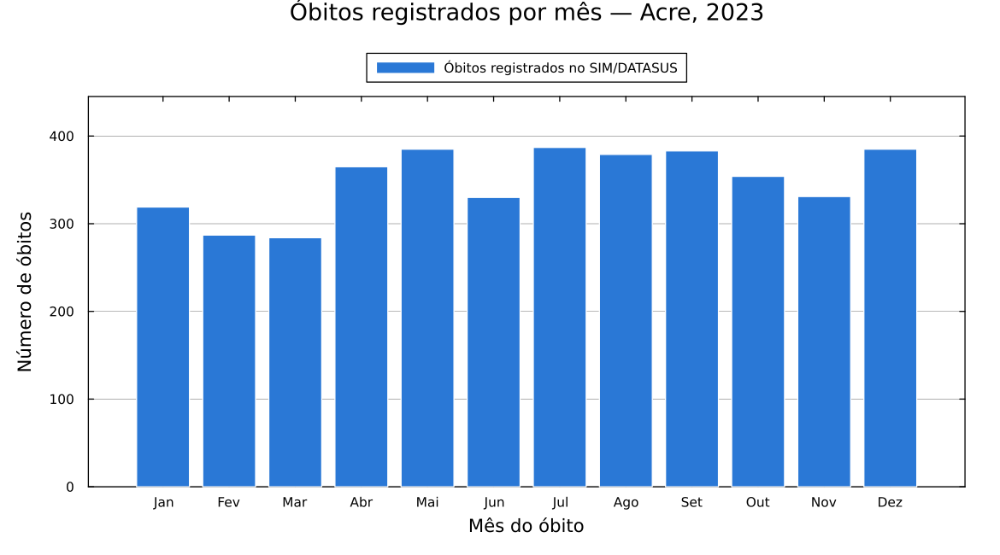
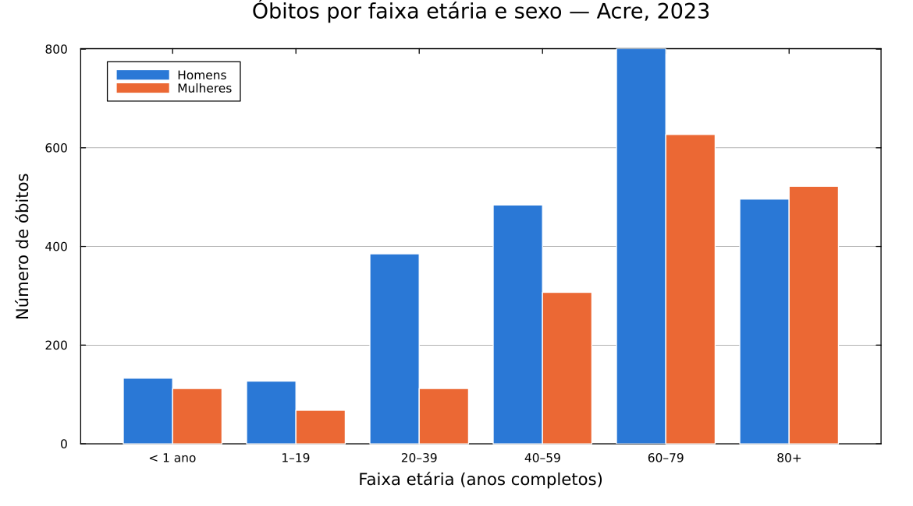
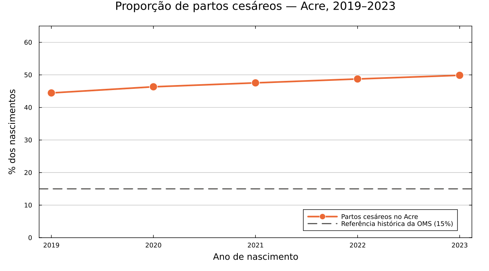

# Exemplos práticos (para quem está começando)

Esta página é um passo a passo completo para quem **nunca programou** e
quer usar os dados públicos de saúde do Brasil. Você não precisa saber
nada de Julia, de estatística ou de informática em saúde para seguir os
exemplos: é só copiar, colar e rodar.

Ao final você terá um gráfico como este, feito com dados reais do
Ministério da Saúde:



!!! note "O que é o DATASUS?"
    O DATASUS é o departamento do Ministério da Saúde que publica, de
    graça, os registros de saúde do Brasil inteiro. São os chamados
    **microdados**: uma linha para cada óbito, cada nascimento, cada
    internação. O MicroSUS.jl serve para baixar e abrir esses arquivos
    sem que você precise entrar no site do DATASUS.

    Os sistemas usados nesta página:

    - **SIM** — Sistema de Informações sobre Mortalidade. Uma linha por
      óbito registrado no Brasil.
    - **SINASC** — Sistema de Informações sobre Nascidos Vivos. Uma
      linha por bebê nascido vivo.

---

## Antes de começar: instalando o Julia

Julia é a linguagem de programação que vamos usar. Baixe e instale a
partir do site oficial: [julialang.org/downloads](https://julialang.org/downloads/).

Depois de instalar, abra o programa **Julia**. Vai aparecer uma janela
preta (ou branca) com este símbolo esperando você digitar:

```
julia>
```

Esse é o *console* do Julia — o lugar onde você digita comandos. É nele
que tudo abaixo acontece.

---

## Passo 1: Instalando e carregando

Um "pacote" é um conjunto de ferramentas prontas que outra pessoa já
escreveu. Precisamos de quatro:

| Pacote | Para que serve |
|---|---|
| `MicroSUS` | Baixa e abre os dados do DATASUS |
| `DataFrames` | Organiza os dados em forma de tabela (como uma planilha) |
| `Plots` | Desenha os gráficos |
| `StatsPlots` | Acrescenta tipos de gráfico extras (usado no Exemplo 2) |

Copie e cole o bloco abaixo no console do Julia e aperte **Enter**:

```julia
using Pkg
Pkg.add(["MicroSUS", "DataFrames", "Plots", "StatsPlots"])
```

Explicando linha por linha:

- `using Pkg` — carrega o **gerenciador de pacotes** do Julia, a
  ferramenta que instala outros pacotes.
- `Pkg.add([...])` — manda instalar os quatro pacotes da lista. Os
  colchetes `[ ]` agrupam vários itens; as aspas `" "` indicam que são
  nomes de texto.

!!! tip "Isso demora — mas só na primeira vez"
    A instalação baixa e compila bastante coisa: pode levar de 5 a 15
    minutos. Uma vez instalados, os pacotes ficam no seu computador
    para sempre e você nunca mais precisa repetir este comando.

Instalado, agora **carregue** os pacotes. Instalar é como comprar uma
ferramenta; carregar é tirá-la da gaveta para usar. Isso precisa ser
feito toda vez que você abrir o Julia:

```julia
using MicroSUS
using DataFrames
using Dates
using Plots
```

- `using Dates` — o Julia já vem com este pacote embutido (não precisa
  instalar). Ele entende datas e permite perguntar coisas como "de que
  mês é esta data?".

---

## Passo 2: Baixando os dados do SUS

Agora vamos pedir os registros de óbito do estado do **Acre** no ano de
**2023**:

```julia
obitos = fetch_datasus(:SIM_DO; uf = "AC", anos = 2023)
```

Explicando cada pedaço:

- `obitos =` — cria uma "caixa" chamada `obitos` e guarda o resultado
  dentro dela. O nome é escolha sua: poderia ser `dados`, `tabela` etc.
- `fetch_datasus(...)` — a função que faz **tudo de uma vez**: acha o
  arquivo no servidor do Ministério da Saúde, baixa, descompacta, lê e
  organiza em tabela.
- `:SIM_DO` — qual sistema queremos. `:SIM_DO` são as declarações de
  óbito. Os dois-pontos na frente fazem parte do nome, não esqueça.
- `uf = "AC"` — a sigla do estado. Troque por `"SP"`, `"BA"`, `"PE"`...
- `anos = 2023` — o ano desejado.

Escolhemos o Acre porque é um estado pequeno: o arquivo baixa rápido e
o exemplo funciona bem em qualquer computador. Estados grandes como São
Paulo funcionam igual, só demoram mais.

!!! tip "Baixou uma vez, não baixa de novo"
    O MicroSUS guarda os arquivos baixados no seu computador. Se você
    rodar o mesmo comando amanhã, ele usa a cópia local e responde na
    hora, sem internet.

### Espiando o que veio

Vale conferir o que você tem em mãos antes de fazer o gráfico:

```julia
nrow(obitos)
```

- `nrow` significa *number of rows*, número de linhas. Cada linha é um
  óbito. Para o Acre em 2023 o resultado é **4189**.

```julia
first(obitos[:, [:DTOBITO, :SEXO, :IDADE_ANOS, :RACACOR, :CAUSABAS]], 5)
```

- `obitos[:, [...]]` — escolhe algumas colunas da tabela. Os dois-pontos
  sozinhos, antes da vírgula, significam "todas as linhas".
- `first(..., 5)` — mostra só as 5 primeiras linhas, para não encher a
  tela com milhares.

O resultado:

```
5×5 DataFrame
 Row │ DTOBITO     SEXO       IDADE_ANOS  RACACOR  CAUSABAS
     │ Date        String?    Int64?      String?  String15
─────┼─────────────────────────────────────────────────────
   1 │ 2023-01-01  Masculino          81  Parda    C349
   2 │ 2023-01-01  Feminino           56  Parda    J159
   3 │ 2023-01-01  Feminino           54  Branca   I219
   4 │ 2023-01-01  Masculino          57  Parda    C169
   5 │ 2023-01-01  Feminino           64  Parda    B342
```

Repare que o MicroSUS já fez o trabalho chato por você: `SEXO` veio
escrito como "Masculino"/"Feminino" (no arquivo original é "1"/"2"),
`DTOBITO` virou uma data de verdade e `IDADE_ANOS` já está em anos
completos (no arquivo original a idade é um código de três dígitos).

As colunas mais úteis do SIM:

| Coluna | O que é |
|---|---|
| `DTOBITO` | Data do óbito |
| `SEXO` | Masculino / Feminino |
| `IDADE_ANOS` | Idade em anos completos |
| `RACACOR` | Raça/cor declarada |
| `CAUSABAS` | Causa básica do óbito, em código CID-10 |
| `CODMUNRES` | Código IBGE do município de residência |
| `LOCOCOR` | Onde ocorreu (hospital, domicílio, via pública...) |

---

## Passo 3: Criando o gráfico

Queremos saber **em que meses morreram mais pessoas**. Isso tem duas
partes: primeiro contar, depois desenhar.

### 3.1 Contando os óbitos de cada mês

```julia
obitos.mes = month.(obitos.DTOBITO)
```

- `obitos.DTOBITO` — pega a coluna das datas.
- `month(...)` — devolve o número do mês de uma data (janeiro = 1).
- O **ponto** em `month.(...)` é a parte importante: ele manda aplicar a
  função em *cada* data da coluna, uma por uma. Sem o ponto, o Julia
  tentaria pegar o mês da coluna inteira e daria erro.
- `obitos.mes =` — guarda o resultado como uma coluna nova, chamada
  `mes`, na mesma tabela.

```julia
por_mes = combine(groupby(obitos, :mes), nrow => :obitos)
sort!(por_mes, :mes)
```

- `groupby(obitos, :mes)` — separa a tabela em 12 montinhos, um por mês.
- `combine(..., nrow => :obitos)` — para cada montinho, conta as linhas
  e chama esse número de `obitos`. O resultado é uma tabela pequena, de
  12 linhas.
- `sort!(por_mes, :mes)` — ordena de janeiro a dezembro. A exclamação
  `!` é uma convenção do Julia: avisa que a função **modifica** a tabela
  em vez de devolver uma cópia.

Confira o resultado digitando `por_mes`:

```
12×2 DataFrame
 Row │ mes    obitos
─────┼───────────────
   1 │     1     319
   2 │     2     287
   3 │     3     284
   ⋮  │  ⋮       ⋮
  12 │    12     385
```

### 3.2 Desenhando

Primeiro, uma lista com os nomes dos meses — números no eixo de um
gráfico são feios e pouco claros:

```julia
meses = ["Jan", "Fev", "Mar", "Abr", "Mai", "Jun",
         "Jul", "Ago", "Set", "Out", "Nov", "Dez"]
```

Agora um ajuste de estilo que vale para todos os gráficos da sessão:

```julia
default(fontfamily = "sans-serif", framestyle = :box, grid = :y,
        gridalpha = 0.25, size = (900, 500), margin = 6Plots.mm)
```

- `default(...)` — define a aparência padrão, para não repetir isso em
  cada gráfico.
- `grid = :y` com `gridalpha = 0.25` — desenha apenas as linhas de grade
  horizontais, bem clarinhas: ajudam a ler os valores sem competir com
  os dados.
- `size = (900, 500)` — largura e altura em pixels.
- `margin = 6Plots.mm` — uma folga nas bordas, para o título e os
  rótulos não ficarem cortados.

E finalmente o gráfico:

```julia
bar(meses[por_mes.mes], por_mes.obitos,
    title     = "Óbitos registrados por mês — Acre, 2023",
    xlabel    = "Mês do óbito",
    ylabel    = "Número de óbitos",
    label     = "Óbitos registrados no SIM/DATASUS",
    color     = "#2a78d6",
    linecolor = :white,
    linewidth = 1,
    legend    = :outertop,
    ylims     = (0, maximum(por_mes.obitos) * 1.15))
```

Linha por linha:

- `bar(x, y)` — desenha barras. O primeiro valor é o que vai no eixo
  horizontal; o segundo, a altura das barras.
- `meses[por_mes.mes]` — troca os números (1, 2, 3...) pelos nomes
  ("Jan", "Fev", "Mar"...). Os colchetes servem para buscar itens de uma
  lista pela posição.
- `title` — o título. Diga **o quê**, **onde** e **quando**: quem olha o
  gráfico sozinho, sem o texto ao redor, precisa entender.
- `xlabel` / `ylabel` — o nome de cada eixo, sempre com a unidade.
- `label` — o texto da legenda; aqui também aproveitamos para dizer de
  onde vêm os dados.
- `color = "#2a78d6"` — a cor das barras, em código hexadecimal (o mesmo
  padrão usado em sites). Este é um azul de bom contraste, legível
  também por quem tem daltonismo.
- `linecolor = :white` — uma bordinha branca separando as barras.
- `legend = :outertop` — põe a legenda **fora** da área do gráfico, em
  cima. Assim ela nunca cobre uma barra.
- `ylims = (0, ...)` — o eixo vertical começa no zero. Isso é importante:
  um gráfico de barras que não começa no zero exagera as diferenças. O
  `* 1.15` deixa 15% de respiro acima da barra mais alta.

Para salvar a figura em arquivo:

```julia
savefig("obitos_por_mes.png")
```

O arquivo vai para a pasta onde o Julia está rodando. Se não souber
qual é, digite `pwd()` para descobrir.

Pronto — este é o gráfico do começo da página.

!!! warning "Cuidado ao interpretar"
    O gráfico mostra **quantos óbitos foram registrados**, não o risco
    de morrer. Estados com mais habitantes têm mais óbitos simplesmente
    por serem maiores. Para comparar lugares diferentes é preciso
    dividir pela população (calcular uma *taxa*).

---

## Como adaptar ao seu caso

Mudando uma palavra do comando do Passo 2 você muda tudo:

```julia
# outro estado
obitos = fetch_datasus(:SIM_DO; uf = "PE", anos = 2023)

# vários anos de uma vez
obitos = fetch_datasus(:SIM_DO; uf = "AC", anos = 2019:2023)

# dois estados
obitos = fetch_datasus(:SIM_DO; uf = ["PE", "BA"], anos = 2023)

# nascimentos em vez de óbitos
nasc = fetch_datasus(:SINASC; uf = "AC", anos = 2023)

# internações hospitalares (mensal: precisa dizer os meses)
inter = fetch_datasus(:SIH_RD; uf = "AC", anos = 2023, meses = 1:12)

# dengue no Brasil inteiro (arquivo nacional: uf é ignorada)
dengue = fetch_datasus(:SINAN_DENGUE; anos = 2023)
```

Quando você pede vários anos ou estados, o MicroSUS empilha tudo numa
tabela só e acrescenta as colunas `UF_ARQUIVO`, `ANO_ARQUIVO` e (nas
fontes mensais) `MES_ARQUIVO`, dizendo de qual arquivo cada linha veio.

Para ver a lista completa do que dá para baixar:

```julia
fontes() |> DataFrame
```

| Identificador | Sistema | Periodicidade |
|---|---|---|
| `:SIM_DO` | Óbitos (SIM) | anual, por estado |
| `:SINASC` | Nascidos vivos | anual, por estado |
| `:SIH_RD` | Internações hospitalares | mensal, por estado |
| `:SIA_PA` | Produção ambulatorial | mensal, por estado |
| `:CNES_ST` | Estabelecimentos de saúde | mensal, por estado |
| `:CNES_PF` | Profissionais de saúde | mensal, por estado |
| `:SINAN_DENGUE` | Dengue | anual, nacional |
| `:SINAN_CHIKUNGUNYA` | Chikungunya | anual, nacional |
| `:SINAN_ZIKA` | Zika | anual, nacional |
| `:SINAN_MALARIA` | Malária | anual, nacional |
| `:SINAN_TUBERCULOSE` | Tuberculose | anual, nacional |
| `:SINAN_VIOLENCIA` | Violência interpessoal/autoprovocada | anual, nacional |

---

## Exemplo 2: Óbitos por faixa etária e sexo

Um gráfico com **duas séries lado a lado**, para comparar homens e
mulheres em cada idade. Continuamos com a tabela `obitos` do Passo 2.

Este exemplo usa o `StatsPlots`, então carregue-o também:

```julia
using StatsPlots
```

Primeiro, uma função que transforma a idade exata em faixa etária:

```julia
function faixa_etaria(idade)
    ismissing(idade) && return missing
    idade < 1  && return "< 1 ano"
    idade < 20 && return "1–19"
    idade < 40 && return "20–39"
    idade < 60 && return "40–59"
    idade < 80 && return "60–79"
    return "80+"
end
```

- `function ... end` — cria uma função, uma receita reaproveitável.
- `ismissing(idade) && return missing` — nos microdados nem todo campo
  está preenchido; o Julia chama esses buracos de `missing`. A linha diz:
  "se a idade estiver faltando, devolva `missing` e pare por aqui".
- As linhas seguintes são testadas em ordem, de cima para baixo. Quando
  chega em `idade < 40`, já sabemos que a idade é 20 ou mais, porque as
  faixas anteriores não se aplicaram.

Aplicando a função e contando:

```julia
obitos.faixa = faixa_etaria.(obitos.IDADE_ANOS)
dados = dropmissing(obitos, [:faixa, :SEXO])
```

- De novo o **ponto** em `faixa_etaria.(...)`: aplica a receita a cada
  idade da coluna.
- `dropmissing(...)` — descarta as linhas em que a faixa ou o sexo não
  foram informados. Sem isso o gráfico teria uma categoria vazia.

```julia
ordem    = ["< 1 ano", "1–19", "20–39", "40–59", "60–79", "80+"]
homens   = [count(r -> r.faixa == f && r.SEXO == "Masculino", eachrow(dados)) for f in ordem]
mulheres = [count(r -> r.faixa == f && r.SEXO == "Feminino",  eachrow(dados)) for f in ordem]
```

- `ordem` fixa a sequência das faixas no eixo. Sem isso o Julia
  ordenaria em ordem alfabética e "80+" apareceria antes de "< 1 ano".
- `[... for f in ordem]` — repete a mesma conta para cada faixa e junta
  os resultados numa lista. Lê-se: "para cada `f` em `ordem`, faça...".
- `count(r -> ..., eachrow(dados))` — percorre as linhas (`eachrow`) e
  conta quantas satisfazem a condição. O `r -> ...` é uma pergunta feita
  a cada linha `r`; `&&` significa "e" (as duas condições ao mesmo tempo).

O gráfico:

```julia
groupedbar(ordem, hcat(homens, mulheres),
    label     = ["Homens" "Mulheres"],
    color     = ["#2a78d6" "#eb6834"],
    title     = "Óbitos por faixa etária e sexo — Acre, 2023",
    xlabel    = "Faixa etária (anos completos)",
    ylabel    = "Número de óbitos",
    linecolor = :white,
    linewidth = 1,
    legend    = :topleft)
```

- `groupedbar` — barras agrupadas: para cada faixa etária, duas barras
  vizinhas.
- `hcat(homens, mulheres)` — junta as duas listas em duas colunas, que
  viram as duas barras de cada grupo.
- Em `label` e `color`, os itens são separados por **espaço**, não por
  vírgula. Não é descuido: espaço cria uma linha com duas colunas, que é
  o formato que o `Plots` espera para identificar duas séries.
- Azul e laranja formam um par de alto contraste que continua legível
  para as formas mais comuns de daltonismo — melhor que o clássico
  vermelho/verde.



O gráfico mostra dois padrões conhecidos da saúde pública brasileira: a
mortalidade masculina é bem maior entre 20 e 59 anos, e a diferença se
inverte depois dos 80, quando restam mais mulheres vivas.

---

## Exemplo 3: Uma tendência ao longo do tempo

Agora com dados de **nascimentos**, acompanhando a proporção de partos
cesáreos ao longo de cinco anos.

```julia
nasc = fetch_datasus(:SINASC; uf = "AC", anos = 2019:2023)
```

- `anos = 2019:2023` — os dois-pontos criam um intervalo: 2019, 2020,
  2021, 2022 e 2023. São cinco arquivos, baixados em paralelo e
  empilhados numa tabela só.

```julia
partos = dropmissing(nasc, :PARTO)

resumo = combine(groupby(partos, :ANO_ARQUIVO),
                 nrow => :total,
                 :PARTO => (p -> count(==("Cesáreo"), p)) => :cesareos)

resumo.pct = 100 .* resumo.cesareos ./ resumo.total
sort!(resumo, :ANO_ARQUIVO)
```

- `groupby(partos, :ANO_ARQUIVO)` — separa por ano. `ANO_ARQUIVO` é a
  coluna que o `fetch_datasus` acrescentou dizendo de qual ano veio cada
  linha.
- `nrow => :total` — conta todos os nascimentos do ano.
- `:PARTO => (p -> count(==("Cesáreo"), p)) => :cesareos` — dentro de
  cada ano, olha a coluna `PARTO` e conta quantas vezes aparece
  "Cesáreo".
- `100 .* resumo.cesareos ./ resumo.total` — a conta da porcentagem. Os
  pontos em `.*` e `./` de novo significam "faça isso linha por linha".

O resultado:

```
5×4 DataFrame
 Row │ ANO_ARQUIVO  total  cesareos  pct
─────┼───────────────────────────────────────
   1 │        2019  16268      7232  44.4554
   2 │        2020  15129      7011  46.3415
   3 │        2021  15683      7457  47.5483
   4 │        2022  14474      7055  48.7426
   5 │        2023  14464      7213  49.8686
```

Para tendências no tempo, linha em vez de barra:

```julia
plot(resumo.ANO_ARQUIVO, resumo.pct,
     label  = "Partos cesáreos no Acre",
     color  = "#eb6834",
     lw     = 3,
     marker = :circle,
     ms     = 8,
     markerstrokecolor = :white)

hline!([15], label = "Referência histórica da OMS (15%)",
       color = "#52514e", ls = :dash, lw = 2)

plot!(title  = "Proporção de partos cesáreos — Acre, 2019–2023",
      xlabel = "Ano de nascimento",
      ylabel = "% dos nascimentos",
      ylims  = (0, 65),
      xticks = 2019:2023,
      legend = :bottomright)
```

- `plot(x, y)` — liga os pontos por uma linha. Use linha quando o eixo
  horizontal for tempo; barras quando forem categorias soltas.
- `lw = 3` (*line width*) e `ms = 8` (*marker size*) — linha grossa e
  bolinhas grandes. Com poucos pontos, isso deixa o gráfico mais firme.
- `hline!([15], ...)` — desenha uma linha horizontal na altura 15, para
  servir de comparação.
- A **exclamação** em `hline!` e `plot!` quer dizer "acrescente ao
  gráfico que já existe", em vez de começar um novo. É a mesma convenção
  do `sort!`.
- `ls = :dash` — tracejada. Uma referência não deve competir visualmente
  com o dado.
- `xticks = 2019:2023` — força um rótulo por ano. Sem isso o Julia
  poderia escrever "2019.5", que não existe.



!!! note "Sobre a linha de referência"
    Os 15% vêm de uma recomendação da OMS de 1985. Desde 2015 a
    Organização não defende mais uma meta numérica fixa, e sim que cada
    cesárea seja feita quando houver indicação médica. A linha está no
    gráfico como ponto de comparação histórico, não como meta oficial
    atual.

---

## Problemas comuns

**`UndefVarError: fetch_datasus not defined`**
Você esqueceu de carregar o pacote. Rode `using MicroSUS`.

**`UndefVarError: groupedbar not defined`**
O `groupedbar` vem do StatsPlots, não do Plots. Rode `using StatsPlots`.

**`Warning: arquivos não encontrados no FTP`**
O ano pedido ainda não foi publicado para esse estado, ou o servidor do
DATASUS está fora do ar. Os dados definitivos costumam sair com cerca de
um ano de atraso. Tente um ano anterior.

**O download está muito lento**
O servidor do DATASUS oscila bastante. Comece por um estado pequeno
(`"AC"`, `"RR"`, `"AP"`) e um ano só. Lembre que o arquivo fica salvo:
a segunda vez é instantânea.

**O gráfico não aparece**
Dependendo de como você roda o Julia, a janela do gráfico pode não abrir
sozinha. Salve em arquivo com `savefig("grafico.png")` e abra a imagem
normalmente.

**Aparece `missing` no meio dos dados**
É esperado, e não é erro: significa que aquele campo não foi preenchido
na declaração original. Use `dropmissing(tabela, :COLUNA)` para
descartar essas linhas antes de contar.

---

## Para onde ir agora

- [Exemplos intermediários](exemplos-intermediarios.md) — análises completas
  com dados reais e, principalmente, as armadilhas do dado: denominador
  populacional, padronização por idade, atraso de digitação, join com o IBGE.
- [Leitura: `ler`, filtro, partições](guia/leitura.md) — como ler
  arquivos muito grandes sem estourar a memória do computador, e como
  filtrar as linhas já na leitura.
- [Dimensões: IBGE e CID-10](guia/dimensoes.md) — como descobrir a qual
  doença corresponde um código como `C349`, e como cruzar o código do
  município com as tabelas do IBGE.
- [Download e FTP](guia/download.md) — controle fino sobre quais
  arquivos baixar.
- [Referência da API](api.md) — a lista completa de funções.
